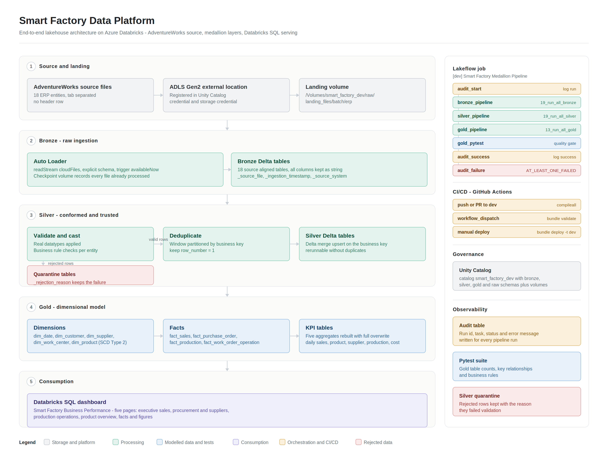

# Smart Factory Data Platform

A complete data engineering project built on Azure Databricks.

It takes 17 raw ERP files, loads them without touching them, cleans them, builds
a reporting model out of them, and shows the result in a five page dashboard.
The pipeline starts by itself when new files arrive, tests its own output, writes
a record of every run, and is deployed from GitHub.



---

## Contents

- [1. What this project is](#1-what-this-project-is)
- [2. Tools used](#2-tools-used)
- [3. The source data](#3-the-source-data)
- [4. The medallion design](#4-the-medallion-design)
- [5. Landing zone and Unity Catalog](#5-landing-zone-and-unity-catalog)
- [6. Bronze layer](#6-bronze-layer)
- [7. Silver layer](#7-silver-layer)
- [8. Gold layer](#8-gold-layer)
- [9. Keeping history with SCD Type 2](#9-keeping-history-with-scd-type-2)
- [10. Loading only new data](#10-loading-only-new-data)
- [11. Data quality and testing](#11-data-quality-and-testing)
- [12. Orchestration with a Lakeflow job](#12-orchestration-with-a-lakeflow-job)
- [13. Audit and monitoring](#13-audit-and-monitoring)
- [14. Deployment and CI/CD](#14-deployment-and-cicd)
- [15. The dashboard](#15-the-dashboard)
- [16. Folder structure](#16-folder-structure)
- [17. How to run it](#17-how-to-run-it)
- [18. Choices I made and why](#18-choices-i-made-and-why)
- [19. What is missing](#19-what-is-missing)
- [20. Proof that it runs](#20-proof-that-it-runs)

---

## 1. What this project is

Many data projects stop after loading a file into a table. The harder parts of
the job start after that:

- How do you load new files without loading the old ones again?
- What happens to a bad row? Do you drop it, or keep it somewhere?
- How do you know the numbers in the dashboard are correct?
- How do you keep last year's price after the price changes this year?
- How do you deploy a pipeline without clicking through a website?
- How do you know a run failed, three days later, without opening the UI?

This project is built around those six questions. Every part of it exists to
answer one of them.

**Size of the project**

| Item | Count |
|---|---|
| Source files | 17 |
| Notebooks | about 60 |
| Bronze tables | 18 |
| Silver tables | 17, plus quarantine tables |
| Gold tables | 14 (5 dimensions, 4 facts, 5 KPI tables) |
| Automated tests | 11 |
| Job tasks | 7 |
| Dashboard pages | 5 |
| Full run time | about 9 minutes on a small cluster |

---

## 2. Tools used

| Area | Tool | Why |
|---|---|---|
| Cloud storage | Azure Data Lake Storage Gen2 | Cheap storage that Databricks reads directly |
| Processing | Azure Databricks, PySpark | Runs the transformations |
| Table format | Delta Lake | Gives merge, time travel and safe reruns |
| Access control | Unity Catalog | One place to control who sees what |
| File loading | Databricks Auto Loader | Tracks which files were already read |
| Job scheduling | Lakeflow Jobs | Task order, retries and failure handling |
| Testing | pytest | Standard Python testing, runs inside the pipeline |
| Reporting | Databricks SQL dashboard | Serves the Gold tables to business users |
| Deployment | Databricks Asset Bundles | Defines the job as code, not as UI clicks |
| CI | GitHub Actions | Checks and deploys the code |

---

## 3. The source data

The source is Microsoft AdventureWorks, sample data for a company that builds
bicycles. I picked it because it contains real factory data, not just sales:
work orders, routing steps, work centres, scrap reasons and bills of materials.
That makes it a fair stand in for a factory ERP export.

The files come from the Microsoft `sql-server-samples` repository on GitHub. They
are tab separated and have **no header row**. That is why the Auto Loader options
set `sep: "\t"` and `header: "false"`, and why the schema is written by hand in
every Bronze notebook.

**The 17 files**

| Area | File | What it holds |
|---|---|---|
| Production | `Product.csv` | Products, price, colour, size, product line |
| Production | `ProductCategory.csv` | Top level categories |
| Production | `ProductSubcategory.csv` | Subcategories |
| Production | `WorkOrder.csv` | Work orders with planned, produced and scrapped quantity |
| Production | `WorkOrderRouting.csv` | Each step of a work order, with cost and hours |
| Production | `Location.csv` | Work centres and their cost rates |
| Production | `ScrapReason.csv` | Reasons material was scrapped |
| Production | `ProductInventory.csv` | Stock by location |
| Production | `TransactionHistory.csv` | Stock movements |
| Production | `BillOfMaterials.csv` | Which parts make which product |
| Purchasing | `Vendor.csv` | Suppliers and credit rating |
| Purchasing | `ProductVendor.csv` | Which supplier supplies which product |
| Purchasing | `PurchaseOrderHeader.csv` | Purchase order header, supplier, dates |
| Purchasing | `PurchaseOrderDetail.csv` | Purchase order lines, ordered, received, rejected |
| Sales | `Customer.csv` | Customers, store or individual |
| Sales | `SalesOrderHeader.csv` | Sales order header, dates, channel, status |
| Sales | `SalesOrderDetail.csv` | Sales order lines, quantity, price, discount |

**Business questions the pipeline answers**

- How much revenue did we make each month, by product, category and channel?
- Which suppliers do we spend most with, and which send the most rejected goods?
- What is our production yield and how much do we scrap?
- How many work orders finish on schedule?
- Which work centres use the most resource hours?

---

## 4. The medallion design

Data moves through three layers. Each layer has exactly one job, and the rules
are strict on purpose.

| Layer | Job | Rule | Table style |
|---|---|---|---|
| Bronze | Copy the source as it is | Change nothing | One table per source file |
| Silver | Clean, check, remove duplicates | Fix everything here | One table per business entity |
| Gold | Build reporting tables | Make querying easy | Star schema plus summaries |

The value of this split is that when a number is wrong, you know where to look.
If Bronze and the source file disagree, the loading is broken. If Silver and
Bronze disagree, a cleaning rule is wrong. If Gold and Silver disagree, the model
is wrong. Without the split, everything is one big query and you have nowhere to
start.

---

## 5. Landing zone and Unity Catalog

Everything sits under one catalog, `smart_factory_dev`, with six schemas:

| Schema | What it holds |
|---|---|
| `raw` | Volumes for landing files, checkpoints, archive and quarantine files |
| `bronze` | Raw tables that match the source |
| `silver` | Cleaned and deduplicated tables |
| `gold` | Dimensions, facts and KPI tables |
| `quarantine` | Rejected records |
| `monitoring` | Audit logs and pipeline run history |

Source files land in an external volume:

```
/Volumes/smart_factory_dev/raw/landing_files/batch/erp/<area>/<entity>/
```

The volume points at a container in ADLS Gen2 through a Unity Catalog external
location and a storage credential.

**Why this matters.** No notebook uses the `abfss://` storage path directly. That
means access is granted in one place, per schema or per volume, instead of by
handing out a storage key. It also means the storage account can be changed later
without editing every notebook.

There are four volumes in total:

| Volume | Purpose |
|---|---|
| `landing_files` | Incoming source files |
| `checkpoint_files` | Auto Loader state, one folder per entity |
| `archive_files` | Files that have been processed |
| `quarantine_files` | Files that are malformed at file level |

---

## 6. Bronze layer

Auto Loader reads the landing folder. It is a streaming read, but it runs with
`trigger(availableNow=True)`, which means it picks up all the files waiting right
now, processes them, then stops. So it behaves like a batch job but keeps the
memory of a stream.

```python
bronze_df = (
    spark.readStream
    .format("cloudFiles")
    .options(**AUTOLOADER_OPTIONS)
    .schema(product_schema)
    .load(source_path)
    .select("*",
        col("_metadata.file_path").alias("_source_file"),
        col("_metadata.file_name").alias("_source_file_name"),
        col("_metadata.file_size").alias("_source_file_size"),
        col("_metadata.file_modification_time").alias("_source_file_modification_time"),
    )
    .withColumn("_ingestion_timestamp", current_timestamp())
    .withColumn("_source_system", lit(SOURCE_SYSTEM))
)
```

**Three choices in this layer**

**1. The schema is written by hand.** Spark is not allowed to guess column types.
Guessing works until one file arrives with a slightly different value, and then
the table shape changes without warning.

**2. Every column is stored as text.** This looks wrong at first. The reason is
simple. If one row has a broken date, I do not want the entire file to fail
loading. Bronze always loads. The broken value is found later in Silver, where
there is a quarantine table to put it in.

**3. Every row carries metadata.** Eight extra columns are added so any row can
be traced back to the exact file it came from:

```
_source_file, _source_file_name, _source_file_size,
_source_file_modification_time, _ingestion_timestamp,
_source_system, _source_schema, _source_entity
```

When someone asks "where did this number come from", the answer is a query, not a
guess.

**Configuration**

`notebooks/02_bronze/00_config.py` holds one dictionary, `ENTITY_CONFIG`, with
the source path, checkpoint path, target table and business keys for all 17
entities. The 17 loading notebooks each read their own entry from it. Nothing is
repeated 17 times.

---

## 7. Silver layer

Three things happen in this order for every entity.

**Step 1: Convert and check**

Text columns become real types: integers, decimals, dates, booleans. Then
business rules run, for example a quantity should not be negative, and a required
key should not be empty.

**Step 2: Quarantine the bad rows**

A row that fails a check is not deleted. It goes into a separate table called
`<entity>_quarantine` with a column `_rejection_reason` saying exactly why.

```python
quarantine_df = checked_df.filter(F.col("_rejection_reason").isNotNull())
clean_df      = checked_df.filter(F.col("_rejection_reason").isNull())
```

This matters more than it sounds. If you drop bad rows quietly, the dashboard
shows clean numbers that are wrong, and nobody ever finds out. If you keep them,
somebody can look at them and fix the source system.

**Step 3: Remove duplicates and merge**

A window function partitions by the business key and keeps the newest record:

```python
window = Window.partitionBy(*business_keys).orderBy(F.col("ModifiedDate").desc())
deduped_df = (df.withColumn("_row_number", F.row_number().over(window))
                .filter(F.col("_row_number") == 1))
```

Then a Delta merge updates existing rows and inserts new ones, matching on the
business key.

**Why a merge and not an append.** Running the pipeline twice gives exactly the
same result as running it once. A pipeline you are afraid to rerun is a pipeline
you cannot fix, because the first thing you want to do after a failure is run it
again.

---

## 8. Gold layer

This layer builds a star schema: fact tables in the middle holding numbers, and
dimension tables around them holding the descriptions you filter and group by.

Full diagram: [`docs/diagrams/02_gold_star_schema.png`](docs/diagrams/02_gold_star_schema.png)

**Dimensions**

| Table | Key | What it describes | History |
|---|---|---|---|
| `dim_date` | `DateKey` | Calendar date, year, month, quarter | Not needed |
| `dim_product` | `ProductKey` | Product name, colour, size, cost, price, line | SCD Type 2 |
| `dim_customer` | `CustomerKey` | Customer account and type | Current only |
| `dim_supplier` | `SupplierKey` | Supplier name and credit rating | Current only |
| `dim_work_center` | `WorkCenterKey` | Production location and cost rate | Current only |

**Facts**

| Table | One row means | Main numbers |
|---|---|---|
| `fact_sales` | one line on a sales order | quantity, unit price, discount, sales amount |
| `fact_purchase_order` | one line on a purchase order | ordered, received, rejected, spend |
| `fact_production` | one work order | planned, produced, scrapped quantity |
| `fact_work_order_operation` | one routing step of a work order | planned cost, actual cost, resource hours |

The "one row means" column is the **grain** of the table. It is the first thing
anyone should ask about a fact table, because if you get it wrong every number
built on it is wrong. I wrote it down for all four.

**KPI tables**

Five small summary tables so the dashboard does not scan the full facts:

| Table | Grouped by | Used on page |
|---|---|---|
| `kpi_daily_sales` | date | Facts and Figures, Sales |
| `kpi_product_sales` | product | Sales, Products |
| `kpi_supplier_performance` | supplier | Procurement |
| `kpi_production_efficiency` | product | Production |
| `kpi_operation_cost` | work centre | Production |

These are rebuilt completely every run with `mode("overwrite")`. They are small,
so a full rebuild is simpler and cheaper than an incremental merge.

**Configuration**

`notebooks/04_gold/00_config.py` holds `GOLD_TABLE_KEYS`, a dictionary listing
the primary key columns of every Gold table. The merge helper and the tests both
read from it, so the key of a table is defined once.

---

## 9. Keeping history with SCD Type 2

Flow diagram: [`docs/diagrams/03_scd_type_2_flow.png`](docs/diagrams/03_scd_type_2_flow.png)

**The problem.** Product details change. A price goes up, a colour is renamed. If
you simply overwrite the old value, last year's sales report changes too, because
it now uses this year's price. Your history becomes wrong every time somebody
edits a product.

**The fix.** SCD Type 2 keeps one row per version of the product, with a date
range saying when that version was correct.

`dim_product` tracks 12 columns: name, product number, category, subcategory,
colour, size, standard cost, list price, make flag, finished goods flag, product
line, class and style.

Every run, the notebook compares each incoming row with the current row, column
by column:

```python
all_values_same = F.lit(True)
for column_name in tracked_columns:
    all_values_same = all_values_same & F.col(f"s.{column_name}").eqNullSafe(
        F.col(f"t.{column_name}")
    )
```

`eqNullSafe` is used instead of `==` so that a null on either side is compared
properly. With a normal `==`, null equals null returns null, not true, and a row
that did not change would look like it changed.

Then one of three things happens:

| Case | Action |
|---|---|
| Product is new | Insert with `ProductVersion = 1` |
| A tracked column changed | Close the old row, insert a new version |
| Nothing changed | Leave the row alone |

Closing the old row is a Delta merge:

```python
.whenMatchedUpdate(set={
    "IsCurrent": "false",
    "EffectiveTo": "s.ChangeTimestamp",
})
```

**The key columns**

| Column | Meaning |
|---|---|
| `ProductKey` | `ProductID-ProductVersion`, unique per version |
| `ProductVersion` | 1, 2, 3 and so on |
| `EffectiveFrom` | When this version became correct |
| `EffectiveTo` | When it stopped being correct, `9999-12-31` if still current |
| `IsCurrent` | True for the latest version |

One `load_timestamp` is used for the whole run, so the old row ends at the exact
moment the new row starts. No gap, no overlap.

**The part that makes it useful**

History is pointless if nothing reads it. `fact_sales` joins the product version
that was correct on the day of the order:

```python
sales_with_product_df = sales_source_df.join(
    product_dim_df,
    (F.col("d.ProductID") == F.col("p.ProductID"))
    & (F.col("h.OrderDate") >= F.col("p.EffectiveFrom"))
    & (F.col("h.OrderDate") < F.col("p.EffectiveTo")),
    "left",
)
```

A sale from 2022 keeps the 2022 price forever, even after the product is
repriced in 2024. Without this join the versions would exist but the report would
still be wrong.

---

## 10. Loading only new data

Flow diagram: [`docs/diagrams/04_incremental_load.png`](docs/diagrams/04_incremental_load.png)

Auto Loader keeps a checkpoint folder listing every file it has already read. On
the next run it reads only new files.

The important detail is **where the state lives**. It is in the checkpoint volume,
not in the Bronze table. So the cost of a run depends on how much new data
arrived, not on how much data already exists. A pipeline that recounts everything
to work out what is new gets slower every month.

**Proving it, not claiming it**

`notebooks/08_incremental_load_demo/01_incremental_customer_999998.py` does this:

1. Counts rows in Bronze, Silver and Gold.
2. Writes one new customer record, id 999998, into the landing folder.
3. Runs the layers.
4. Counts again.
5. Checks that all three layers moved by the same amount.
6. Writes the result into a control table.
7. Raises an error if any layer did not move.

```python
if failed_checks > 0:
    raise ValueError(f"Verification failed for {failed_checks} layer(s).")
```

The result is stored, not just printed, so the check is evidence and not a
screenshot.

---

## 11. Data quality and testing

Two levels.

**Level 1: quarantine in Silver.** Covered above. Bad rows are kept with a
reason, not dropped.

**Level 2: pytest on Gold.** Eleven tests run as a task inside the job. If one
fails, the notebook raises, the task fails and the pipeline stops.

| File | Test | What it catches |
|---|---|---|
| `test_gold_tables.py` | `test_gold_table_exists` | A build step silently did not run |
| | `test_gold_tables_have_required_columns` | A rename broke a downstream query |
| | `test_gold_tables_are_not_empty` | A filter went wrong and removed everything |
| | `test_primary_keys_are_not_null` | A failed join produced null keys |
| | `test_primary_keys_are_unique` | A merge duplicated rows |
| `test_gold_relationships.py` | `test_foreign_keys_have_matching_dimension_rows` | A fact points at a dimension row that does not exist |
| `test_gold_business_rules.py` | `test_sales_values_are_not_negative` | Sign errors in revenue |
| | `test_purchase_values_are_not_negative` | Sign errors in spend |
| | `test_production_rates_are_valid` | Yield above 100 percent or below zero |
| | `test_one_current_row_per_product` | A broken SCD Type 2 merge |
| | `test_product_effective_dates_are_valid` | Overlapping or backwards date ranges |

**The most useful test** is `test_one_current_row_per_product`. If the SCD Type 2
merge breaks, a product ends up with two current rows. Every sale for that
product then joins twice and revenue doubles. That mistake is nearly impossible
to spot by eye in a dashboard, and this test catches it in seconds.

The tests share a `conftest.py` that reuses the running Databricks Spark session
and builds table names from the catalog and schema, so the same tests can be
pointed at a different environment through environment variables.

---

## 12. Orchestration with a Lakeflow job

The job is defined as code in `resources/smart_factory_job.yml`. Seven tasks:

```
audit_start
   -> bronze_pipeline
      -> silver_pipeline
         -> gold_pipeline
            -> gold_pytest
               -> audit_success

audit_failure   (run_if: AT_LEAST_ONE_FAILED)
```

| Task | Notebook | Purpose |
|---|---|---|
| `audit_start` | `07_monitoring_audit/02_log_pipeline_start.py` | Record that a run began |
| `bronze_pipeline` | `02_bronze/19_run_all_bronze.py` | Load all 17 entities |
| `silver_pipeline` | `03_silver/19_run_all_silver.py` | Clean all 17 entities |
| `gold_pipeline` | `04_gold/13_run_all_gold.py` | Build dimensions, facts, KPIs |
| `gold_pytest` | `06_pytest/00_run_pytest.py` | Run the 11 tests |
| `audit_success` | `07_monitoring_audit/03_log_pipeline_success.py` | Record success |
| `audit_failure` | `07_monitoring_audit/04_log_pipeline_failure.py` | Record the error |

**Two details worth pointing out**

`audit_failure` depends on all four processing tasks and uses
`run_if: AT_LEAST_ONE_FAILED`. It writes the error into the audit table, and the
job still finishes in a **failed** state. A failure handler that makes a broken
job look green is worse than having no handler at all.

`max_concurrent_runs` is 1, so two runs can never write the same Delta tables at
the same time.

**Triggering**

The job can be started by hand, or automatically when a new file lands in the
landing volume. File arrival is the right trigger here because the pipeline is
batch and the natural signal is new data. A schedule would run the job when there
is nothing to do.

---

## 13. Audit and monitoring

`notebooks/07_monitoring_audit/` creates an audit table and writes to it on every
run. Each record holds:

- start time
- job run id and job name
- how the run was triggered
- final status, success or failure
- the error message if it failed

Because it is a Delta table and not a screen in the UI, the run history can be
queried, charted and alerted on:

```sql
SELECT * FROM smart_factory_dev.monitoring.<audit_table>
ORDER BY 1 DESC LIMIT 20;
```

There are also validation notebooks per layer, `18_validate_bronze.py`,
`18_validate_silver.py` and `12_validate_gold.py`, for checking a single layer
while developing.

---

## 14. Deployment and CI/CD

**Asset Bundle**

`databricks.yml` defines the bundle. It has two targets, `dev` and `prod`, and a
variable for the cluster id. The job definition lives in `resources/`, so the
pipeline is version controlled instead of being clicked together in a UI.

```bash
databricks bundle validate -t dev
databricks bundle deploy -t dev
```

**GitHub Actions**

`.github/workflows/databricks-ci-cd.yml` has two jobs.

| Job | Runs when | What it does |
|---|---|---|
| `code-checks` | Every push and pull request to `dev` | Checkout, Python 3.11, `python -m compileall -q notebooks` |
| `deploy-dev` | Manual trigger only (`workflow_dispatch`) | Install the Databricks CLI, validate the bundle, deploy it |

`code-checks` means a file with a syntax error can never reach the workspace.

`deploy-dev` is deliberately manual, so deployment is a decision rather than
something that happens on every commit. The Databricks host and token are stored
as GitHub secrets.

---

## 15. The dashboard

Five pages, built on the Gold tables, served by a Databricks SQL warehouse. The
SQL behind each page is in `notebooks/05_sql_dashboards/`.

| Page | Main measures | Filters |
|---|---|---|
| Facts and Figures | Total revenue, sales orders, purchase spend, work orders, production yield, scrap rate | Year |
| Sales and Orders | Revenue, orders, units sold, average order value, late shipment percent, monthly trend, revenue by category, online vs offline, top 10 products | Order year, category, customer type, channel |
| Products and Customers | Current products, finished goods, total customers, active customers, product count by category, revenue by customer type, top 10 accounts | Category, customer type |
| Procurement and Vendors | Purchase spend, purchase orders, receipt rate, rejection rate, active vendors, top 10 suppliers, delivery status | Purchase year, vendor |
| Production and Operations | Work orders, planned quantity, yield, scrap rate, schedule adherence, monthly output, resource hours by work centre | Production year, work centre, product |

Screenshots are in [`docs/screenshots/`](docs/screenshots/).

There are also two helper SQL notebooks, `00_data_checks.sql` and
`04_dashboard_validation.sql`, for confirming the dashboard numbers match the
underlying tables.

---

## 16. Folder structure

```
databricks-smart-factory-data-platform/
├── databricks.yml                  Bundle settings, dev and prod targets
├── resources/
│   └── smart_factory_job.yml       Lakeflow job with 7 tasks
├── .github/workflows/
│   └── databricks-ci-cd.yml        Syntax check and deployment
├── notebooks/
│   ├── 00_setup/                   External location, catalog, schemas, volumes
│   ├── 01_ingestion/               Download and verify the source files
│   ├── 02_bronze/                  00_config, 17 Auto Loader notebooks,
│   │                               18_validate, 19_run_all
│   ├── 03_silver/                  00_config, 17 cleaning notebooks,
│   │                               18_validate, 19_run_all
│   ├── 04_gold/                    00_config, 5 dimensions, 4 facts,
│   │                               10_build_kpi_tables, 12_validate, 13_run_all
│   ├── 05_sql_dashboards/          SQL for each dashboard page
│   ├── 06_pytest/                  conftest, 3 test files, notebook runner
│   ├── 07_monitoring_audit/        Audit table and run logging
│   └── 08_incremental_load_demo/   Proof of incremental loading
└── docs/
    ├── diagrams/                   Architecture, star schema, SCD2, incremental
    ├── screenshots/                Pipeline runs and dashboard pages
    └── RUNBOOK.md                  Full setup instructions
```

**Naming convention.** Notebooks are numbered so they sort in run order. Every
layer folder has:

- `00_config` for shared paths, catalog names and table keys, so nothing is
  repeated 17 times
- a `run_all` notebook that calls the others in order with `%run`

The job calls the `run_all` notebooks, not the individual ones.

---

## 17. How to run it

Full setup, including the Azure resources you need first, is in
**[docs/RUNBOOK.md](docs/RUNBOOK.md)**.

**What you need**

- An Azure subscription
- An Azure Databricks workspace, premium tier, with Unity Catalog enabled
- An ADLS Gen2 storage account with hierarchical namespace on
- Permission to create a catalog and an external location
- The Databricks CLI, for bundle deployment

**Steps**

1. In Azure, create the storage account, a container, an access connector, and
   give the connector the Storage Blob Data Contributor role.
2. In Databricks, create a storage credential pointing at the connector.
3. Run the three notebooks in `00_setup/` to create the external location,
   catalog, schemas and volumes.
4. Run `01_ingestion/01_download_adventureworks_source.py` to pull the 17 source
   files into the landing volume.
5. Run `01_ingestion/02_verify_landing_files.py` and confirm 17 files.
6. Run `07_monitoring_audit/01_create_audit_table.py` once.
7. Deploy the bundle:
```bash
   databricks bundle validate -t dev
   databricks bundle deploy -t dev
```
8. Open the job in Jobs and Pipelines and run it.

**If you use different names** for the storage account, container or credential,
change them in the three `00_setup` notebooks and in the `CATALOG` value of every
`00_config` notebook.

**Cost.** Almost all of it is the cluster. Set auto termination to 10 to 20
minutes. A small all purpose cluster on Databricks Runtime 14.3 LTS or newer is
enough.

---

## 18. Choices I made and why

Every choice has a cost. Both sides are listed.

**All columns as text in Bronze**
Cost: types must be converted in Silver, which is extra code.
Gain: one bad value cannot stop a whole file loading, and Bronze always matches
the source exactly, which makes debugging simple.

**Comparing columns one by one in SCD Type 2 instead of using a hash**
Cost: more code, and it gets slow with many columns.
Gain: with only 12 tracked columns it stays readable, and when something changes
I can see which column changed. Past roughly 50 columns I would switch to a hash.

**KPI tables rebuilt fully every run**
Cost: it redoes work that has not changed.
Gain: the tables are small, and an incremental merge would add code and state for
no measurable benefit at this size.

**One job task per layer, not one per table**
Cost: if one table fails, the whole layer task fails, so the error is less
precise.
Gain: 34 separate tasks on one small cluster would spend more time scheduling
than working. At production scale I would split them.

**File arrival trigger instead of a schedule**
Cost: nothing runs if no file arrives, so a broken upload looks like silence.
Gain: the job never runs when there is nothing to do.

**Manual deployment**
Cost: it is not really continuous deployment.
Gain: nothing reaches the workspace by accident. This is a choice I would change
first in a team setting, where automatic deployment to a dev workspace is safer
than a human forgetting.

---

## 19. Proof that it runs

| What it shows | File |
|---|---|
| A full run started by file arrival, about 9 minutes | [`pipeline_2_file_arrival_trigger_runs.png`](docs/screenshots/pipeline_2_file_arrival_trigger_runs.png) |
| The seven job tasks and the failure branch | [`pipeline_1_lakeflow_task_graph.png`](docs/screenshots/pipeline_1_lakeflow_task_graph.png) |
| One new record moving through Bronze, Silver and Gold | [`pipeline_3_incremental_load_verification.png`](docs/screenshots/pipeline_3_incremental_load_verification.png) |
| A successful GitHub Actions deployment | [`pipeline_4_github_actions_run.png`](docs/screenshots/pipeline_4_github_actions_run.png) |
| The five dashboard pages | [`docs/screenshots/`](docs/screenshots/) |

---

## About

- Author: **Arthisree S R**
- LinkedIn: **https://www.linkedin.com/in/arthisree-saraswathi-rajamanickam-b38678191/**

Happy to explain any part of the design.

## License

See [LICENSE](LICENSE).