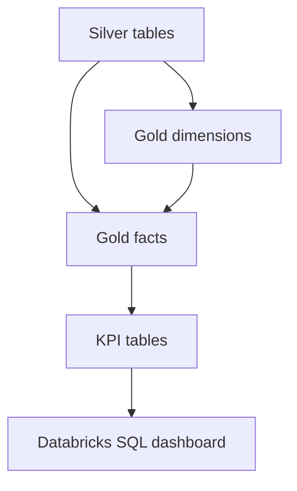

# AdventureWorks Gold Layer

This folder contains a simple, interview-friendly Gold layer for Databricks. The code is
written at beginner to basic-intermediate level: clear transformations, readable Delta
merges, no unnecessary hashes, and one explicit SCD Type 2 example.

## What this package builds

| Table | Type | Grain |
|---|---|---|
| `dim_date` | Dimension | One calendar date |
| `dim_product` | SCD Type 2 dimension | One product version |
| `dim_customer` | Dimension | One customer |
| `dim_supplier` | Dimension | One supplier |
| `dim_work_center` | Dimension | One manufacturing location |
| `fact_sales` | Fact | One sales-order line |
| `fact_purchase_order` | Fact | One purchase-order line |
| `fact_production` | Fact | One work order |
| `fact_work_order_operation` | Fact | One work-order operation |

The package also creates five reporting tables:

- `kpi_daily_sales`
- `kpi_product_sales`
- `kpi_supplier_performance`
- `kpi_production_efficiency`
- `kpi_operation_cost`

## Architecture

## Run in Databricks

1. Import the complete `04_gold` folder into one Databricks workspace folder.
2. Confirm that the `smart_factory_dev.silver` tables already exist and contain data.
3. Attach a cluster with Unity Catalog and Delta Lake support.
4. Open and run `13_run_all_gold.py`.
5. Confirm that `12_validate_gold.py` finishes with only `PASS` results.

The run order is:

1. Date, customer, supplier, and work-center dimensions
2. Product SCD Type 2 dimension
3. Sales, purchase, production, and operation facts
4. KPI tables
5. Gold validation

## Product SCD Type 2

`05_dim_product_scd2.py` compares tracked columns with `eqNullSafe`. When a product
attribute changes:

1. The current version receives `IsCurrent = false`.
2. Its `EffectiveTo` is set to the load timestamp.
3. A new row is inserted with the next `ProductVersion`.
4. The new version receives `IsCurrent = true` and `EffectiveTo = 9999-12-31`.

The code intentionally avoids hashing so the comparison is easy to learn, debug, and
explain in a junior Data Engineer interview.

## Why there is no `fact_machine_operation` yet

The supplied AdventureWorks Silver data contains `LocationID` in work-order routing but
does not contain a real `MachineID`. Therefore this model truthfully creates
`fact_work_order_operation` and `dim_work_center`. A later Event Hubs telemetry phase can
add `dim_machine` and `fact_machine_operation` when real machine events are available.

## Databricks SQL dashboard

Open `11_dashboard_queries.sql` in Databricks SQL. Run each query, choose the suggested
visual type in its comment, save the visualization, and add it to one dashboard. The file
contains KPI cards, monthly sales, top products, supplier quality, production efficiency,
and work-center cost variance.

## Incremental behavior

- Regular dimensions and facts use Delta `MERGE` on their documented business keys.
- Existing matching rows are updated and new rows are inserted.
- `dim_product` preserves changed versions with SCD Type 2 logic.
- KPI tables are rebuilt because they are small reporting aggregates.

## Important boundary

This ZIP is the Gold-layer phase only. Lakeflow Jobs, Event Hubs streaming, Pytest in CI,
Databricks Asset Bundles, failure-recovery demos, screenshots, and the final repository
README belong to the next project phases. Keeping them separate makes this Gold code much
easier to understand and troubleshoot.
